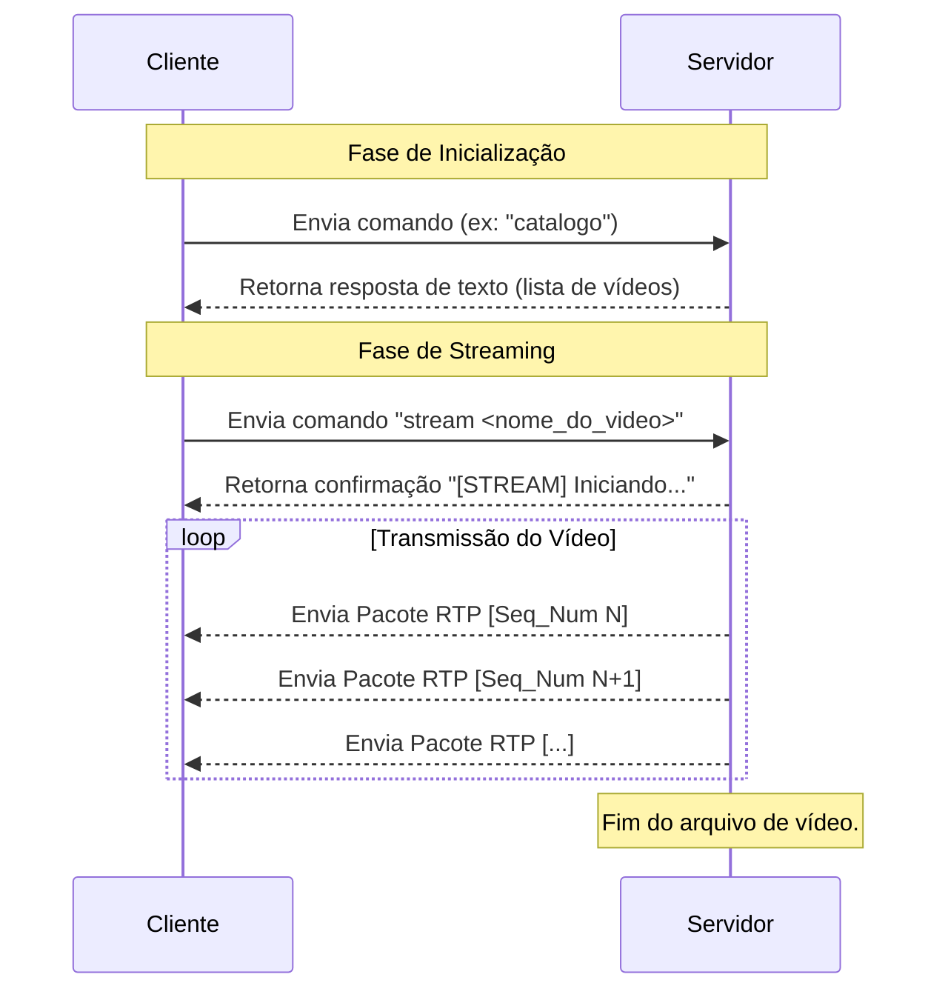

# Análise do Protocolo e Desempenho da Aplicação de Streaming

Este documento detalha o funcionamento do protocolo de comunicação implementado, a estrutura dos pacotes e uma análise de desempenho baseada nas especificações do código fornecido.

## 1. Protocolo e Diagrama de Sequência

O sistema utiliza um protocolo customizado sobre UDP para a troca de comandos e um encapsulamento RTP (Real-time Transport Protocol) para o streaming de vídeo.

### Diagrama de Sequência

O diagrama abaixo ilustra a interação entre cliente e servidor para os principais comandos.



### Justificativa dos Campos e Protocolos

A escolha da pilha de protocolos (IP -> UDP -> RTP/Custom) foi feita pelas seguintes razões:

*   **UDP (User Datagram Protocol):** Foi escolhido como protocolo de transporte por sua natureza não orientada à conexão e baixa latência. Para streaming de vídeo, a velocidade na entrega é mais crítica do que a garantia de que todos os pacotes chegaram, pois o atraso causado por retransmissões (como no TCP) poderia causar congelamentos no vídeo.
*   **Protocolo Customizado (para comandos):** Para comandos como `catalogo` e `help`, um protocolo simples baseado em texto foi implementado. A simplicidade facilita a depuração e a implementação, sendo suficiente para a troca de mensagens curtas e não frequentes.
*   **RTP (Real-time Transport Protocol):** Para o streaming de vídeo, o RTP foi encapsulado sobre UDP. Ele é o padrão da indústria para transporte de mídia em tempo real e fornece campos essenciais:
    *   **Número de Sequência (`seq_num`):** Permite ao cliente detectar a perda de pacotes e reordená-los caso cheguem fora de ordem, garantindo a integridade da sequência de vídeo. No código, ele é incrementado a cada pacote enviado.
    *   **Timestamp:** Ajuda a sincronizar a reprodução do vídeo no cliente, fornecendo informações temporais sobre quando um frame deve ser exibido.
    *   **SSRC (Synchronization Source):** Identifica unicamente a fonte do stream, útil em cenários com múltiplas fontes.
    *   **Tipo de Payload:** Indica o tipo de mídia sendo transportada (no caso, MPEG-TS, payload type 33).

## 2. Catálogo de Vídeos

O servidor, através do código em `servidor/command/catalog.py`, foi implementado para listar dinamicamente todos os arquivos com a extensão `.ts` que se encontram no diretório `videos/`.

Por exemplo, se o diretório `videos/` contiver os seguintes arquivos:

*   `istockphoto-2170838017-640_adpp_is.ts`
*   `medium.ts`
*   `world.ts`

Ao receber o comando `catalogo` do cliente, o servidor irá ler o diretório e retornará a seguinte lista formatada como resposta:

```
[CATALOGO] Vídeos disponíveis:
  1. istockphoto-2170838017-640_adpp_is.ts
  2. medium.ts
  3. world.ts
```
## 3. Estrutura dos Cabeçalhos

A comunicação entre cliente e servidor é feita através de pacotes brutos, cuja estrutura de cabeçalhos é montada manualmente no código.

A estrutura geral de um pacote enviado pela rede é:

`[ Cabeçalho IP | Cabeçalho UDP | Carga Útil (Payload) ]`

Para o streaming de vídeo, a carga útil é um pacote RTP:

`[ Cabeçalho IP | Cabeçalho UDP | [ Cabeçalho RTP | Dados do Vídeo (MPEG-TS) ] ]`

Abaixo, o detalhamento de cada cabeçalho:

#### Cabeçalho IP (20 Bytes)
*   **Versão/IHL (1 byte):** Versão do IP (4) e tamanho do cabeçalho.
*   **TOS (1 byte):** Tipo de Serviço.
*   **Tamanho Total (2 bytes):** Comprimento total do pacote (cabeçalho + dados).
*   **ID (2 bytes):** Identificação do pacote.
*   **Flags/Offset (2 bytes):** Flags de fragmentação e offset.
*   **TTL (1 byte):** Tempo de Vida do pacote.
*   **Protocolo (1 byte):** Protocolo da camada superior (UDP = 17).
*   **Checksum (2 bytes):** Checksum do cabeçalho IP.
*   **IP Origem (4 bytes):** Endereço IP do remetente.
*   **IP Destino (4 bytes):** Endereço IP do destinatário.

#### Cabeçalho UDP (8 Bytes)
*   **Porta Origem (2 bytes):** Porta do serviço remetente.
*   **Porta Destino (2 bytes):** Porta do serviço destinatário.
*   **Tamanho (2 bytes):** Comprimento do segmento UDP (cabeçalho + dados).
*   **Checksum (2 bytes):** Checksum para verificação de erros.

#### Cabeçalho RTP (12 Bytes) - *Usado apenas para vídeo*
*   **V/P/X/CC (1 byte):** Versão (2), Padding, Extensão, CSRC Count.
*   **M/PT (1 byte):** Marcador e Tipo de Payload (33 para MPEG-TS).
*   **Número de Sequência (2 bytes):** Usado para ordenação dos pacotes.
*   **Timestamp (4 bytes):** Usado para sincronia de tempo na reprodução.
*   **SSRC (4 bytes):** Identificador da fonte de sincronização.

## 4. Quantidade de Bytes para Dados

Analisando o arquivo `servidor/command/stream.py`, a quantidade de bytes reservada exclusivamente para os dados de vídeo (a carga útil do RTP) em cada pacote é de **1316 bytes**.

```python
# Lê 1316 bytes (7 pacotes MPEG-TS)
chunk = video_file.read(1316)
```

Essa escolha é intencional, pois um pacote padrão MPEG-TS (usado em transmissões de TV digital e arquivos `.ts`) tem 188 bytes. Ao agrupar 7 desses pacotes, obtemos `7 * 188 = 1316 bytes`, otimizando o envio sem exceder o MTU (Maximum Transmission Unit) típico da rede.

## 5. Quantidade de Pacotes por Frame

A quantidade de pacotes por frame depende da **taxa de bits (bitrate)** e da **taxa de frames por segundo (FPS)** de cada vídeo. Usando a ferramenta `ffprobe`, obtivemos os valores reais para cada vídeo do projeto.

A fórmula para o cálculo é:
`Pacotes por Frame = ArredondarParaCima(Tamanho do Frame em Bytes / 1316)`
Onde: `Tamanho do Frame em Bytes = (Bitrate em bps / 8) / FPS`

A seguir, aplicamos essa fórmula aos vídeos do projeto.

### Cálculo para `world.ts`
*   **FPS:** 30
*   **Bitrate:** 906.294 bps

1.  **Tamanho do Frame em Bytes:**
    `(906.294 bps / 8) / 30 fps = 3.776 bytes/frame`

2.  **Pacotes por Frame:**
    `ceil(3.776 bytes / 1316 bytes/pacote) = ceil(2.87) =` **3 pacotes**

### Cálculo para `medium.ts`
*   **FPS:** 30
*   **Bitrate:** 4.549.750 bps

1.  **Tamanho do Frame em Bytes:**
    `(4.549.750 bps / 8) / 30 fps = 18.957 bytes/frame`

2.  **Pacotes por Frame:**
    `ceil(18.957 bytes / 1316 bytes/pacote) = ceil(14.40) =` **15 pacotes**

### Cálculo para `istockphoto-2170838017-640_adpp_is.ts`
*   **FPS:** 25
*   **Bitrate:** 871.897 bps

1.  **Tamanho do Frame em Bytes:**
    `(871.897 bps / 8) / 25 fps = 4.359 bytes/frame`

2.  **Pacotes por Frame:**
    `ceil(4.359 bytes / 1316 bytes/pacote) = ceil(3.31) =` **4 pacotes**

## 6. Taxa de Transmissão para um Stream

A taxa de transmissão da rede (bitrate total) para manter um stream depende do bitrate do vídeo e inclui o overhead dos cabeçalhos (IP, UDP, RTP).

O overhead por pacote é de `20 (IP) + 8 (UDP) + 12 (RTP) = 40 bytes`.
O tamanho total de um pacote de vídeo é `1316 (dados) + 40 (cabeçalhos) = 1356 bytes`.

Vamos calcular a taxa de rede para cada vídeo do projeto:

### Taxa de Transmissão para `world.ts`
*   **FPS:** 30
*   **Bitrate do vídeo:** 906.294 bps

1.  **Pacotes de dados por segundo:**
    `906.294 bps / 8 bits/byte = 113.286,75 bytes/s`
    `113.286,75 bytes/s / 1316 bytes/pacote ≈ 86,08 pacotes/s`

2.  **Taxa de transmissão total na rede:**
    `86,08 pacotes/s * 1356 bytes/pacote = 116.709,68 bytes/s`
    `116.709,68 bytes/s * 8 bits/byte = 933.677,44 bps ≈` **0.93 Mbps**

### Taxa de Transmissão para `medium.ts`
*   **FPS:** 30
*   **Bitrate do vídeo:** 4.549.750 bps

1.  **Pacotes de dados por segundo:**
    `4.549.750 bps / 8 bits/byte = 568.718,75 bytes/s`
    `568.718,75 bytes/s / 1316 bytes/pacote ≈ 432,15 pacotes/s`

2.  **Taxa de transmissão total na rede:**
    `432,15 pacotes/s * 1356 bytes/pacote = 585.975,90 bytes/s`
    `585.975,90 bytes/s * 8 bits/byte = 4.687.807,20 bps ≈` **4.69 Mbps**

### Taxa de Transmissão para `istockphoto-2170838017-640_adpp_is.ts`
*   **FPS:** 25
*   **Bitrate do vídeo:** 871.897 bps

1.  **Pacotes de dados por segundo:**
    `871.897 bps / 8 bits/byte = 108.987,125 bytes/s`
    `108.987,125 bytes/s / 1316 bytes/pacote ≈ 82,82 pacotes/s`

2.  **Taxa de transmissão total na rede:**
    `82,82 pacotes/s * 1356 bytes/pacote = 112.379,92 bytes/s`
    `112.379,92 bytes/s * 8 bits/byte = 899.039,36 bps ≈` **0.90 Mbps**
